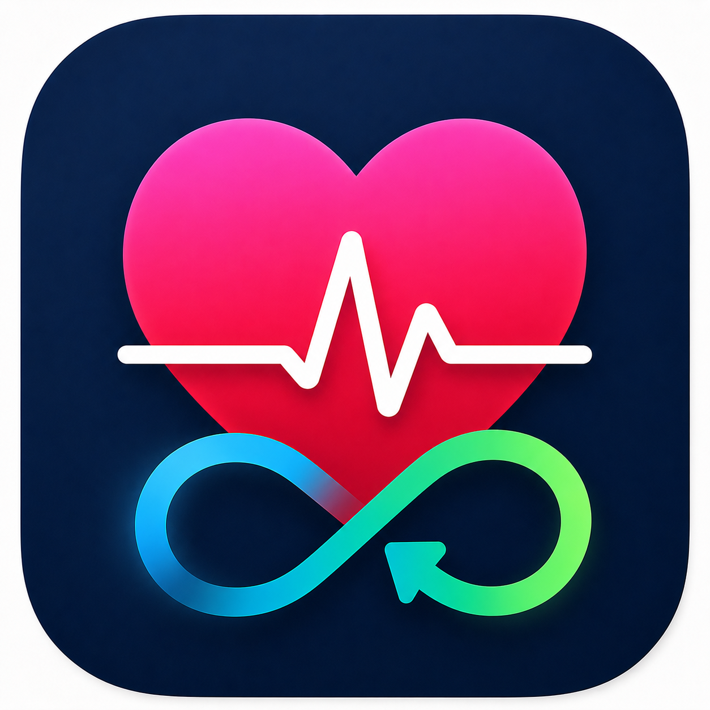

<p align="center">
  
</p>

<h1 align="center">Vitalsync</h1>

<p align="center">
  <a href="https://github.com/iomz/vitalsync/actions/workflows/ci.yml"></a>
  <a href="LICENSE"></a>
  
  
</p>

iOS app for syncing selected Apple Health data to Vitalsync receiver endpoints.

Vitalsync is a personal project. It is not a medical device and is not intended for diagnosis, treatment, emergency use, or clinical monitoring.

## Requirements

- Xcode 26 or newer
- iPhone with Health app data
- Apple Developer team with HealthKit capability enabled for bundle ID

## Configure signing

Edit `Configuration/Signing.xcconfig`:

```xcconfig
PRODUCT_BUNDLE_IDENTIFIER = your.bundle.id
DEVELOPMENT_TEAM = YOURTEAMID
```

Xcode can also set these values in target signing settings.

## Run on iPhone

Connect iPhone, trust Mac, then run:

```sh
./scripts/deploy-iphone.sh
```

Optional overrides:

```sh
TEAM_ID=YOURTEAMID BUNDLE_ID=your.bundle.id DEVICE_NAME="My iPhone" ./scripts/deploy-iphone.sh
```

Script builds and installs through Xcode automatic signing. If multiple devices are attached, set `DEVICE_NAME`.

## Run local receiver

The local receiver is stdlib-only Python and stores data in SQLite. For iPhone testing on your LAN, run it from an editable checkout:

```sh
VITALSYNC_ADMIN_TOKEN="$(openssl rand -hex 32)" \
VITALSYNC_PUBLIC_BASE_URL="http://YOUR_MAC_LAN_IP:8790" \
./scripts/run-receiver.sh
```

Or install and run the receiver package directly:

```sh
python -m pip install -e receiver
python -m vitalsync_receiver
```

Direct package runs bind to `127.0.0.1` by default. Set `VITALSYNC_HOST=0.0.0.0` when the receiver must accept LAN traffic.

Docker Compose runs the receiver on port `8790`, binds it to localhost for reverse-proxy use, and persists SQLite data in the `vitalsync-data` Docker volume mounted at `/data`. Create a local env file first:

```sh
cp .env.example .env
printf 'VITALSYNC_ADMIN_TOKEN=%s\n' "$(openssl rand -hex 32)" >> .env
docker compose up vitalsync-receiver
```

On iPhone, set Account -> Receiver -> API base URL to a host reachable from the device, not `localhost`:

```text
http://YOUR_MAC_LAN_IP:8790/vitalsync/v1
```

Device registration is closed by default. Normal iPhone registration uses an admin-issued, short-lived, one-time pairing token. Open registration is only enabled when the receiver is started with `--open-registration` or `VITALSYNC_OPEN_REGISTRATION=1`; do not enable it on an internet-exposed receiver.

The admin token is the receiver-owner/root secret. Keep it on the receiver operator machine for maintenance operations, issuing one-time pairing tokens, and creating read-only consumer tokens. Do not store the admin token in the iOS app, README examples, screenshots, logs, or normal read-only clients.

Create a short-lived iPhone pairing token:

```sh
curl -sS -X POST "http://127.0.0.1:8790/vitalsync/v1/admin/pairing-tokens" \
  -H "Authorization: Bearer $VITALSYNC_ADMIN_TOKEN" \
  -H "Content-Type: application/json" \
  -d '{"schema":"vitalsync.pairing_token_request.v1","client_type":"iphone","scopes":["write:healthkit"],"ttl_seconds":600}'
```

Register the iPhone with the returned one-time `pairing_token`:

```sh
curl -sS -X POST "http://127.0.0.1:8790/vitalsync/v1/devices/register" \
  -H "Content-Type: application/json" \
  -d '{"schema":"vitalsync.device_registration.v1","pairing_token":"<PAIRING_TOKEN>","device_label":"My iPhone","platform":"iOS","app_version":"0.1.0"}'
```

In the iOS app, paste the raw `pairing_token` into Account -> Device -> Pairing token. If you open the returned `vitalsync://register?...` URL on iPhone, the app fills the receiver URL and normalizes `base_url=https://receiver.example.com` to `https://receiver.example.com/vitalsync/v1`.

Successful registration consumes the pairing token and returns normal refresh/access tokens with `write:healthkit`. Pairing tokens are stored hashed in SQLite, expire after their TTL, and cannot be reused. Set `VITALSYNC_PUBLIC_BASE_URL=https://receiver.example.com` to make generated endpoint URLs use `https://receiver.example.com/vitalsync/v1/...`; pairing responses also include a future-facing `vitalsync://register?...` URL.

## Background sync

Background sync is off by default. Open Sync -> Background sync and enable it after device registration and Health access are configured.

Vitalsync uses two iOS background mechanisms:

- HealthKit background delivery is the primary trigger. When enabled, the app registers `HKObserverQuery` instances for each enabled sample type and calls `enableBackgroundDelivery(..., frequency: .immediate)`. HealthKit can wake the app after new matching Health data arrives.
- `BGAppRefreshTask` is a fallback periodic refresh. The app submits `io.sazanka.vitalsync.refresh` with an earliest begin date about six hours in the future and resubmits it after each background run.

Background execution is still controlled by iOS. The six-hour interval is a throttle and earliest request time, not a guaranteed schedule. HealthKit observer wakes and app refresh wakes both call the same incremental sync path, which uploads new records, stores anchors only after successful upload, and retries queued batches first.

The incremental sync cursor is HealthKit's `HKQueryAnchor`, persisted locally per sample type. Each sync asks HealthKit for records and deletions since the saved anchor. Vitalsync saves the new anchor only after pending and new batches upload successfully, so failed uploads are re-queried on the next sync.

Sync summary UI is stored in app `UserDefaults`: last attempt time, last successful sync time, counts, and last error. Anchors and pending upload batches are stored in the app data container. Installing a new build through Xcode with the same bundle ID normally preserves that container; deleting the app removes these app data files. Keychain credentials can survive app deletion depending on iOS behavior and signing identity.

Retry pending uploads only retries queue files that still decode as current `VitalsyncBatch` JSON. If an older or corrupt queue file cannot be decoded, the app quarantines it, removes it from the pending count, and reports that the unreadable pending batch was skipped. Because anchors are saved only after successful upload, running Sync now re-queries data that was not uploaded.

The app declares both `fetch` and `healthkit` background modes. HealthKit capability must remain enabled for the bundle ID.

The minimal scope model is:

```text
write:healthkit  iPhone device upload access
read:healthkit   read-only API consumer access
```

Future `ingest` registration uses a read-only client identity rather than a fake HealthKit device:

```sh
curl -sS -X POST "http://127.0.0.1:8790/vitalsync/v1/admin/pairing-tokens" \
  -H "Authorization: Bearer $VITALSYNC_ADMIN_TOKEN" \
  -H "Content-Type: application/json" \
  -d '{"schema":"vitalsync.pairing_token_request.v1","client_type":"ingest","scopes":["read:healthkit"],"ttl_seconds":600}'

curl -sS -X POST "http://127.0.0.1:8790/vitalsync/v1/clients/register" \
  -H "Content-Type: application/json" \
  -d '{"schema":"vitalsync.client_registration.v1","pairing_token":"<PAIRING_TOKEN>","client_type":"ingest","client_label":"ingest on receiver.example.com"}'
```

Create a consumer read token:

```sh
curl -sS -X POST "http://127.0.0.1:8790/vitalsync/v1/consumer-tokens" \
  -H "Authorization: Bearer $VITALSYNC_ADMIN_TOKEN" \
  -H "Content-Type: application/json" \
  -d '{"scope":["read:activity","read:sleep","read:vitals","read:body","read:blood_pressure","read:workouts"],"expires_in_seconds":86400}'
```

Fetch records:

```sh
curl -sS "http://127.0.0.1:8790/vitalsync/v1/records?sample_type=step_count" \
  -H "Authorization: Bearer <READ_TOKEN>"
```

Daily step totals are exposed as `sample_type=daily_step_count`.

Inspect receiver storage stats:

```sh
curl -sS "http://127.0.0.1:8790/vitalsync/v1/admin/stats" \
  -H "Authorization: Bearer $VITALSYNC_ADMIN_TOKEN"
```

The stats response includes database size, device/client counts, batch totals, record totals, and per-sample-type counts/latest timestamps. Receiver logs also include one `batch_upload` line per accepted upload with batch ID, record counts, duplicate flag, JSON read time, SQLite store time, and total request time.

### Receiver backup and restore

The receiver stores all durable state in one SQLite database. Docker Compose uses the `vitalsync-data` volume and stores the database at `/data/vitalsync.sqlite3` inside the container. Direct local runs use `VITALSYNC_DB`, or `./vitalsync.sqlite3` when `VITALSYNC_DB` is unset.

For a Docker Compose backup, stop the receiver first so SQLite has a quiet checkpoint, then copy the database files out of the named volume:

```sh
mkdir -p backups
docker compose stop vitalsync-receiver
docker run --rm \
  -v vitalsync-data:/data:ro \
  -v "$PWD/backups:/backup" \
  alpine sh -c 'cp /data/vitalsync.sqlite3* /backup/'
docker compose up -d vitalsync-receiver
```

For a direct local receiver backup, stop the receiver and copy the configured database file plus any SQLite sidecars:

```sh
mkdir -p backups
cp "${VITALSYNC_DB:-vitalsync.sqlite3}"* backups/
```

To restore Docker Compose data, stop the receiver, keep a copy of the current volume contents, copy the backup into the volume, then start the receiver:

```sh
docker compose stop vitalsync-receiver
mkdir -p backups/pre-restore
docker run --rm \
  -v vitalsync-data:/data \
  -v "$PWD/backups:/backup" \
  alpine sh -c 'cp /data/vitalsync.sqlite3* /backup/pre-restore/ 2>/dev/null || true; rm -f /data/vitalsync.sqlite3 /data/vitalsync.sqlite3-wal /data/vitalsync.sqlite3-shm; cp /backup/vitalsync.sqlite3* /data/'
docker compose up -d vitalsync-receiver
```

Restoring an older receiver database can make iOS HealthKit anchors newer than receiver data. After restoring, open the app, reset sync history, and run Sync now so the app re-queries HealthKit and repopulates missing receiver records. Receiver upserts are idempotent by `source` and `source_id`, so repeated records collapse instead of duplicating.

Uploaded and queried timestamps must be valid ISO-8601 values. The receiver normalizes accepted timestamps to UTC before storing them.

WebTransport upload is specified but not implemented in this stdlib receiver; iOS falls back to `POST /batches`.

### Revoke vs purge

`revoke` disables a device and all of its tokens while preserving historical data. Use this when a real device should no longer be allowed to sync, but its previously submitted data should remain. Client revocation should follow the same model when it is exposed.

`purge` permanently deletes a device registration and its associated tokens. It is intended for development cleanup, failed registration attempts, and removing test identities.

Current device purge also deletes associated HealthKit records and batches for that device. Sample-type purge deletes matching HealthKit records. Client purge is not currently exposed.

## Manual Xcode flow

```sh
open Vitalsync.xcodeproj
```

Select `Vitalsync` scheme, choose iPhone destination, verify signing, then Run.

## Source layout

- `Vitalsync/Sources`: SwiftUI app, HealthKit mapping, sync engine, transport, App Intents.
- `Vitalsync/SupportingFiles`: Info.plist and HealthKit entitlement.
- `Configuration`: signing overrides used by Xcode project and deploy script.
- `receiver`: Python SQLite local receiver implementing the HTTP API spec.
- `docs`: Claude-generated architecture and API reference artifacts.
